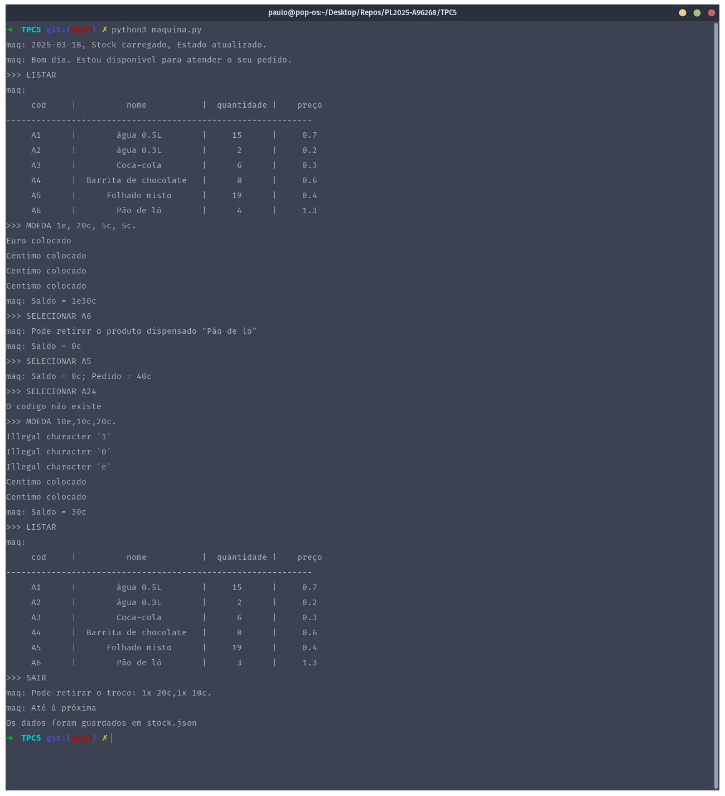

# Manifesto TPC5

## 📌 Informação do TPC e do Aluno  

- **Título:** Máquina de Vending
- **Data:** 2025-03-17
- **Autor:**  
    <table>
    <tr>
        <td></td>
        <td>
        <strong>Nome:</strong> Paulo Alexandre Rodrigues Ferreira<br>
        <strong>Número:</strong> A96268
        </td>
    </tr>
    </table>

**Resumo:** 

Este trabalho tem como objetivo desenvolver um programa em Python que simule o funcionamento de uma máquina de vending (máquina de venda automática). O programa gere um stock de produtos, onde cada item é caracterizado por um ID, nome, quantidade disponível e preço. Para garantir a persistência dos dados, a informação do stock é armazenada e atualizada num ficheiro JSON, designado por `stock.json`. Este ficheiro é carregado no início da execução do programa e atualizado no seu término, assegurando que as alterações realizadas durante a execução sejam mantidas.

Além das funcionalidades básicas de consulta e venda de produtos, o programa inclui uma funcionalidade adicional que permite ao utilizador adicionar novos produtos ou atualizar a quantidade de produtos já existentes no stock. Esta funcionalidade visa aumentar a flexibilidade e utilidade da aplicação, permitindo uma gestão dinâmica do stock.

## 📂 Resultados

O primeiro passo consistiu em ler o ficheiro JSON (`stock.json`) que contém a informação dos produtos disponíveis na máquina. Para exibir o stock de forma organizada, foi implementada a função `listStock`, que formata e apresenta os dados em formato tabular.

**Exemplo de Output:**
```
maq:
     cod     |          nome           |  quantidade |    preço    
-------------------------------------------------------------
    A12     |       Sumo de Laranja    |      5      |    1.50    
    B07     |       Água Mineral       |      10     |    1.00    
```

De seguida foi implementado um sistema de carregamento de moedas, onde o utilizador pode inserir euros e cêntimos. O estado do saldo é atualizado e exibido após cada operação. O modo de carregamento é ativado pelo comando `MOEDA` e desativado pelo comando `.`, esta funcionalidade foi implementada com o auxilio do modulo `ply.lex` que permite uma fácil implementação de estados e tokens, assim como a troca entre eles.

**Exemplo de Interação:**
```
>>> MOEDA 1e 50c
Euro colocado
Centimo colocado
maq: Saldo = 1e50c
```

Após a implementação do carregamento da maquina, adicionou-se a possiblidade do utilizador selecionar um produto para compra utilizando o comando `SELECIONAR` seguido do código do produto. O sistema verifica se o produto existe, se há stock disponível, e se o saldo é suficiente para a compra. Caso a compra seja bem-sucedida, o stock é atualizado e o saldo é reduzido.

**Exemplo de Interação:**
```
>>> SELECIONAR A12
maq: Pode retirar o produto dispensado "Sumo de Laranja"
maq: Saldo = 50c
```

Ao finalizar a interação com o comando `SAIR`, o sistema calcula o troco em moedas de 1c, 2c, 5c, 10c, 20c, 50c, 1e e 2e. O troco é exibido ao utilizador, e o estado da máquina é guardado no ficheiro JSON.

**Exemplo de Interação:**
```
>>> SAIR
maq: Pode retirar o troco: 1x 50c.
maq: Até à próxima
Os dados foram guardados em stock.json
```

Com isto concluimos que o simulador da máquina de vendas automáticas funcionou como esperado, cumprindo todos os objetivos propostos. O sistema é simples de usar e consegue lidar bem com operações básicas, como carregar dinheiro, listar produtos, fazer compras e devolver troco. A utilização de um ficheiro JSON para guardar os dados garante que o estado da máquina não se perde entre utilizações, assim como pedido no enunciado.

**Exemplo de Teste Completo:**




O simulador da máquina de vendas automáticas funcionou como esperado, cumprindo todos os objetivos propostos. O sistema é simples de usar e consegue lidar bem com operações básicas, como carregar dinheiro, listar produtos, fazer compras e devolver troco. A utilização de um ficheiro JSON para guardar os dados garante que o estado da máquina não se perde entre utilizações, assim como pedido no enunciado.